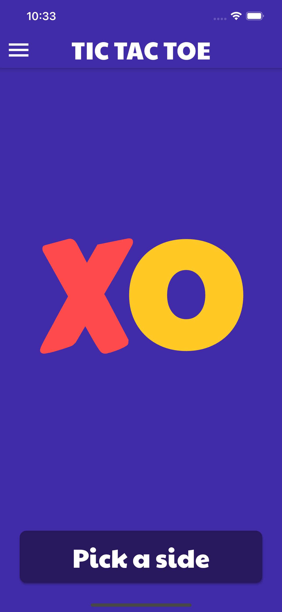

# Tic-Tac-Toe 🎃

A simple mobile game built with `Flutter`

[](https://github.com/SaiManojBotchu/TicTacToe)

Don't forget to give a star if you like this project 😅😊

> **Note**: This repository is still under development and I will continue to add more features to it! 🙃

## Table of Contents 📜

1. [General Info](#general-info-)
2. [Preview](#preview-)
3. [Screenshots](#screenshots-)
4. [Getting Started](#getting-started-)
5. [Features](#features-)
6. [Technologies](#technologies-)
7. [Dependencies](#dependencies-)
8. [Contact Me](#contact-me-)


## General Info 📝

The purpose of this project was to practice Flutter development by creating simple mobile game.

## Preview 🎥
      

## Screenshots 📷
             
              
               
        


## Getting Started 🚀

**1. [ Setup Flutter](https://flutter.io/setup/)**

**2. Clone the repo**

```sh
$ git clone https://github.com/SaiManojBotchu/TicTacToe.git
$ cd TicTacToe/
```

**3. Install dependencies**
```sh
$ flutter pub get
```

**4. Run app**
```sh
$ flutter run
```

## Features ➕

**Current Features:**

1. Splash Screen.
2. Background music.
3. Game sounds.
4. User can change the name of players.
5. User can select his avatar.
6. Selecting win score and draw score.
7. Timer when playing game.
8. Minimal Animations.

**Upcoming Features:**

1. Storing data in cache using Shared Preferences.
2. Addinng a show case widget for settings in Welcome Screen.
3. Adding computer logic using minimax algorithm 🧠.

## Technologies 👨🏻‍💻

[](https://flutter.dev/)   
[](https://dart.dev/)   

## Dependencies 📚

[](https://pub.dev/packages/anitex)  
[](https://pub.dev/packages/lottie)  
[](https://pub.dev/packages/delayed_display)  
[](https://pub.dev/packages/rflutter_alert)  
[](https://pub.dev/packages/assets_audio_player)  


## Contact Me 📞
**SaiManoj**

- Gmail: [@saimanoj2826](mailto:saimanoj2826@gmail.com)
- Twitter: [@saimanoj2826](https://twitter.com/saimanoj2826)
- Github: [@SaiManojBotchu](https://github.com/SaiManojBotchu)
- LinkedIn: [@SaiManojBotchu](https://www.linkedin.com/in/SaiManojBotchu)
